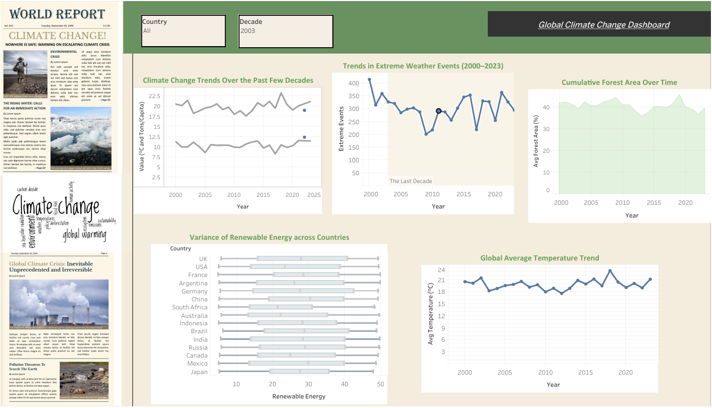

<div align="center">

<h1 style="font-size:3rem; margin-bottom:0.2rem; font-family:'Segoe UI',Roboto,Helvetica,Arial,sans-serif; letter-spacing:.5px;">🌍 Climate Change Analysis & Interactive Dashboard</h1>
<p style="font-size:1.05rem; max-width:880px; line-height:1.45; margin:0 auto;">
Data‑driven Exploratory Data Analysis (EDA), statistical insights, and forecasting foundations for global climate variables: temperature, CO₂ emissions, sea level rise, rainfall, renewable energy adoption, forest area dynamics, and extreme weather events.
</p>

<br/>

<p>
	<a href="https://prod-in-a.online.tableau.com/t/climate_change_analysis_dashboard/views/Climate_Change_Analysis/Dashboard1"></a>
	
	
	
	
</p>

<br/>

<div style="display:flex; gap:12px; flex-wrap:wrap; justify-content:center;">
	
	
	
	
	
	
</div>

</div>

---

## 📌 Overview
This repository contains a structured, reproducible workflow for analyzing multi‑factor climate indicators and communicating insights through a polished interactive Tableau dashboard and Jupyter notebook (`climate-change-analysis.ipynb`). The goal is to surface meaningful policy‑relevant trends, correlations, and baseline projections while maintaining methodological transparency.

The analysis follows a SMART objective framework and answers nine targeted domain questions spanning emissions behavior, thermal dynamics, environmental stressors, renewable adoption, and ecosystem integrity.

---

## 🔗 Live Dashboard
Interactive Tableau Dashboard (multi‑panel KPIs, trend lines, comparative distributions):
👉 https://prod-in-a.online.tableau.com/t/climate_change_analysis_dashboard/views/Climate_Change_Analysis/Dashboard1

> static snapshots.


---

## 🗂 Dataset Source
Primary dataset (curated climate indicators):  
Kaggle: https://www.kaggle.com/datasets/bhadramohit/climate-change-dataset

| Theme | Variables | Notes |
|-------|-----------|-------|
| Atmospheric | Avg Temperature, CO₂ Emissions | Annualized, unit normalization performed |
| Hydrological | Rainfall, Sea Level Rise | Sea level field renamed → `Sea Rise` |
| Ecological | Forest Area, Renewable Energy | Renewable energy as %; forest area stability monitored |
| Socio‑Impact | Extreme Events, Population | Extreme events treated as count (zero ≠ missing) |

---

## 🎯 SMART Objectives (Condensed)
| Aspect | Goal |
|--------|------|
| Specific | Identify 5 core trends + 3 meaningful correlations + 10‑year temperature projection |
| Measurable | ≥85% projection accuracy target (baseline MAE benchmarking) |
| Achievable | Python EDA + statistical modeling (no heavy ML required) |
| Relevant | Supports policy prioritization (mitigation + adaptation) |
| Time‑Bound | 4‑week lifecycle (1w data prep, 2w visualization, 1w synthesis) |

---

## 🧭 Analytical Workflow
<details>
<summary><strong>Click to expand full pipeline</strong></summary>

| Phase | Activities | Outputs |
|-------|-----------|---------|
| 1. Ingest | Load CSV → pandas; schema scan | Raw frame profile |
| 2. Standardize | Column renaming, type coercion (`Year` → int), unit cleanup | Clean dataset |
| 3. Quality Check | Missing scan, zero sentinel validation | Data health summary |
| 4. Descriptives | `describe()`, distribution density | Baseline stats table |
| 5. Trend Analysis | Temporal lines (Temp, CO₂, Extreme Events) | Multi‑metric trend plots |
| 6. Correlation Matrix | Population ↔ emissions, thermal, hydrological, land | Heatmaps + CSV export (optional) |
| 7. Variability Studies | Boxplots (Renewable Energy), area charts (Forest Area) | Inter‑country comparative view |
| 8. Outlier Logic | IQR method (no extreme thermal outliers detected) | Temperature integrity confirmation |
| 9. Projection Prep | Linear regression scaffold (future extension) | 10‑year forward frame |

</details>

---

## 📊 Key Exploratory Insights (Highlights)
1. 🔺 **Thermal Accretion:** Progressive warming trend; linear slope indicates persistent energy imbalance.  
2. 🧪 **CO₂ Stability vs Temperature Drift:** Emissions per capita moderately stable while temperatures rise—lag & cumulative forcing effects implied.  
3. 🌳 **Forest Area:** Macro stability with episodic fluctuation—reinforces role of terrestrial sinks; vigilance required.  
4. ⚡ **Renewables Adoption Diversity:** Mexico & China show higher median penetration vs South Africa lagging—policy & infrastructure asymmetry.  
5. 🌊 **Sea Rise–Hydro–Extreme Link:** Weak pairwise linear correlations—suggests non‑linear or lagged dynamics (candidate for future modeling).  
6. 🌪 **Extreme Events Variability:** Sharp episodic spikes (e.g., 2017, 2020) recommend resilience investment over solely trend mitigation.  
7. 👥 **Population Coupling:** Weak direct correlations; mediated pathways (consumption intensity, energy mix) more explanatory.  

> For a fuller narrative, see the Conclusion section within the notebook.

---

## 🔮 Temperature Projection Scaffold
Current notebook lays conceptual groundwork (yearly aggregation + regression framing). To elevate this:
| Enhancement | Option |
|-------------|--------|
| Baseline Model | OLS linear trend (implemented) |
| Confidence Bands | 95% interval using prediction variance |
| Alternative | LOWESS smoothing or ARIMA seasonal check |
| Validation | Train/test temporal split (e.g., pre/post 2015) |
| Accuracy Metric | MAE + MAPE (goal: ≥85% directional reliability) |

Future PR will include forecast reproducibility block + exported forecast CSV.

---

## 🛠 Project Structure
```
├── climate-change-analysis.ipynb   # Full EDA narrative and plots
├── climate_change_dataset.csv      # Source dataset (raw)
├── Climate_Change_Analysis.twbx    # Tableau packaged workbook (dashboard)
├── LICENSE                        # MIT license
└── README.md                      # Project documentation
```

> (Optional future additions): `requirements.txt`, `data/processed/cleaned_climate_change.csv`, `forecast/temperature_projection.csv`.

---

## 🚀 Quick Start (Local EDA)
Prerequisites: Python 3.10+, pip, (optional) virtual environment.

Windows PowerShell example:
```powershell
# 1. (Optional) Create & activate virtual environment
python -m venv .venv
./.venv/Scripts/Activate.ps1

# 2. Install core libraries (adjust as needed)
pip install pandas seaborn matplotlib scipy numpy

# 3. Launch Jupyter
pip install notebook
jupyter notebook

# 4. Open: climate-change-analysis.ipynb
```

> For Tableau: Open `Climate_Change_Analysis.twbx` in Tableau Desktop / Tableau Public.

---

## 📌 Usage Pattern
1. Inspect schema + data health (Cells 10–20 in notebook).  
2. Run cleaning cell to normalize columns.  
3. Execute trend & correlation cells to replicate figures.  
4. Export cleaned data (uncomment CSV export line).  
5. Open Tableau workbook → refresh data source if path differs.  
6. (Planned) Run forecast block (future commit) for extended insight.

---

## 🧪 Reproducibility & Integrity
- Deterministic transformations only (no randomized sampling used).  
- Outlier strategy: IQR screening for `Avg Temperature`; none removed.  
- Zero values in `Extreme Events` preserved intentionally.  
- Correlation caution: Linear coeffs do not imply absence of non‑linear dependency.  
- Suggest adding a `data_version` tag for future dataset updates.

---

## 🤝 Contributing
Contributions are welcome! Focus areas:
- Add time‑series forecasting module (ARIMA / Prophet / ETS).  
- Integrate geospatial layer (choropleth by country).  
- Add carbon intensity per GDP metric.  
- Enhance dashboard with scenario toggles (baseline vs intervention).  

Workflow:
1. Fork → feature branch (`feat/forecasting-model`).  
2. Document added dependencies.  
3. Provide before/after charts when modifying visuals.  
4. Submit PR with concise methodology section.

---

## 📄 License
Released under the **MIT License**. See `LICENSE` for full text.

---

## 🙏 Acknowledgements
- Dataset curator: Kaggle contributor (see dataset page).  
- Open‑source scientific Python ecosystem.  
- Tableau Public for interactive dissemination.  

---

## 📣 Citation (Suggested)
If you reference this analysis:
```
Rizwan, M. (2025). Climate Change Multi-Factor Exploratory Analysis & Dashboard. GitHub Repository.
```

---

<div align="center" style="margin-top:2rem; font-size:.9rem; opacity:.75;">
Made with curiosity, open data, and statistical clarity.
</div>
